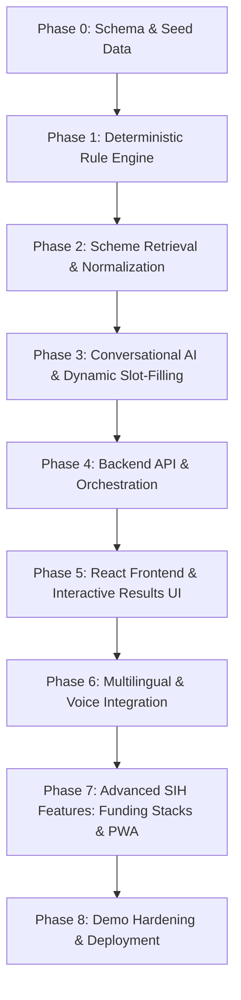

# Project Execution Blueprint: SchemeSaathi (UDYAM_IN)
> **AI-Driven Government Scheme Matching & Actionable Advisory System**  
> *Smart India Hackathon (SIH) Implementation Breakdown*

---

## 🧭 Core Architectural Philosophy

Before writing a single line of frontend UI, the system adheres to this uncompromised rule:
1. **LLM Talks & Extracts:** Handles conversational NLU, slot-filling, and translates technical rule traces into plain Hindi/English.
2. **Database Filters:** Rapidly filters 5,000+ schemes down to 10–30 relevant candidates using indexed metadata (Category, Gender, State, Purpose, Business Type).
3. **Rule Engine Decides:** A 100% deterministic, audit-proof engine evaluates candidate rules and returns `ELIGIBLE`, `NOT_ELIGIBLE`, or `NEED_INFO`.
4. **Actionable Output:** Provides clause-by-clause traces, gap analysis (why user failed + how much off), and direct application routing (SCA / Bank / Incubator).

---

## 📊 Phase-Wise Execution Matrix



---

## 🛠️ Detailed Phase Breakdown

---

### 🔹 Phase 0: Project Setup, Schemas & Verified Seed Corpus
**Goal:** Establish repository structure, database models, and a verified corpus of ~18 government schemes with legal provenance.

* **Tasks:**
  1. Initialize monorepo structure: `/backend` (Node.js/Express) and `/frontend` (React/Vite).
  2. Define MongoDB / Mongoose models:
     * `Scheme` (id, name, organization, targetBeneficiaries, conditions[], requiredFields[], financialBenefits, applicationRoute, documents[], sources[], verifiedOn).
     * `Profile` (conversationId, category, gender, age, familyIncome, businessType, projectCost, udyamRegistered, state).
     * `Conversation` (messages, currentIntent, candidateSchemes, state).
     * `MatchLog` (provenance audit trail).
  3. Curate and verify ~18 flagship schemes across 5 mandatory sources:
     * **NSFDC:** Term Loan Scheme (TLS), Micro Credit Yojana (MCY), Mahila Samriddhi Yojana (MSY), Udyam Nidhi.
     * **NBCFDC:** New Swarnima, Saksham, Mahila Samriddhi, Shilp Sampada, Krishi Sampada.
     * **NSKFDC:** General Term Loan, Swachhta Udyami Yojana, Mahila Samriddhi.
     * **Stand-Up India:** Stand-Up India MSME Loan Scheme.
     * **ASIIM / VCF-SC:** Ambedkar Social Innovation & Incubation Mission, VCF-SC.
     * **Flagship Collateral-Free / Subsidy:** PMEGP, Mudra (Shishu/Kishore), PM Vishwakarma.
  4. Write `seedSchemes.js` and validation script to verify schema integrity, required provenance URLs, and rule operators (`==`, `!=`, `<`, `<=`, `>`, `>=`, `IN`, `NOT_IN`).
* **Deliverables:**
  * `backend/src/models/*.js`
  * `backend/seed/schemes.json` (18 verified schemes)
  * `backend/seed/seedSchemes.js` (Idempotent seed runner: `npm run seed`)

---

### 🔹 Phase 1: Standalone Deterministic Rule Engine
**Goal:** Build and independently unit-test the pure JavaScript rule engine to ensure 0% hallucination in eligibility checks.

* **Tasks:**
  1. Build `operators.js`: Strict evaluators for comparison operators (`<=`, `>=`, `==`, `IN`, `NOT_IN`, range checks).
  2. Build `conditionEvaluator.js`: Evaluates individual condition against a user profile. Handles missing fields safely.
  3. Build `ruleEngine.js`:
     * Returns one of three definitive states: `ELIGIBLE`, `NOT_ELIGIBLE`, `NEED_INFO`.
     * If a mandatory condition fails $\rightarrow$ `NOT_ELIGIBLE`.
     * If all known conditions pass but required fields are missing $\rightarrow$ `NEED_INFO` (with array of `missingFields`).
     * If all required conditions evaluate to `true` $\rightarrow$ `ELIGIBLE`.
  4. Build `traceGenerator.js` & `gapAnalyzer.js`:
     * Generates human-readable audit trace (Field, User Value, Required Value, Result, Clause, Source URL).
     * Calculates quantitative gaps for rejections (e.g., *"Income exceeds limit by ₹1,00,000"*).
  5. Write automated unit test suite (`Jest` / `Node test runner`) covering 20+ edge cases.
* **Deliverables:**
  * `backend/src/rules/ruleEngine.js`
  * `backend/src/rules/conditionEvaluator.js`
  * `backend/src/rules/traceGenerator.js`
  * Comprehensive test suite passing with 100% coverage.

---

### 🔹 Phase 2: Scheme Retrieval & Normalization Layer
**Goal:** Fast sub-millisecond filtering of 5,000+ schemes down to 10–30 candidate schemes using indexed metadata.

* **Tasks:**
  1. Configure MongoDB Compound Indexes:
     * `{ purpose: 1, applicableCategories: 1, applicableGender: 1, states: 1 }`
  2. Build `normalization.js`:
     * Normalizes colloquial Indian business terms (*"silai shop"*, *"tailor shop"*, *"stitching"* $\rightarrow$ `tailoring`).
     * Standardizes currency values (*"dhai lakh"* $\rightarrow$ `250000`, *"50 hazar"* $\rightarrow$ `50000`).
  3. Implement Purpose & Category Taxonomy validation.
  4. Build `schemeRetriever.js` with candidate ranking score:
     * Scores candidates by relevance (Exact purpose match +5, Business type +4, Category match +4, State match +3).
* **Deliverables:**
  * `backend/src/retrieval/schemeRetriever.js`
  * `backend/src/retrieval/filters.js`
  * `backend/src/utils/normalization.js`

---

### 🔹 Phase 3: Conversational AI & Dynamic Question Engine
**Goal:** Connect LLM for natural-language extraction (slot filling) and compute the next smartest question to ask.

* **Tasks:**
  1. Build `llmService.js` (OpenAI / Gemini / Anthropic API wrapper with structured JSON output enforcement).
  2. Design `slotFillingPrompt.js`:
     * Extracts parameters (`category`, `gender`, `familyIncome`, `businessType`, `projectCost`, `state`, `udyamRegistered`) from conversational text/Hinglish.
  3. Build Dynamic Question Ordering (`dynamicQuestionService.js`):
     * Compares `candidateSchemes[].requiredFields` against `knownUserProfileFields`.
     * Uses an **Information Gain / Elimination Heuristic** (asks for the field that resolves or eliminates the most candidate schemes first).
  4. Support the two core user paths:
     * **Journey A:** Known Scheme (e.g., *"I want Stand-Up India"* $\rightarrow$ direct to that scheme's required fields).
     * **Journey B:** Unknown Scheme (e.g., *"I need a loan for tailoring shop"* $\rightarrow$ intent identification $\rightarrow$ candidate retrieval $\rightarrow$ progressive slot filling).
* **Deliverables:**
  * `backend/src/services/llmService.js`
  * `backend/src/services/conversationService.js`
  * `backend/src/prompts/slotFillingPrompt.js`

---

### 🔹 Phase 4: Express API & Orchestration Layer
**Goal:** Build clean, secure REST API endpoints connecting all backend services.

* **Tasks:**
  1. `POST /api/chat/start`: Initializes a new conversation session.
  2. `POST /api/chat/message`: Receives user text/voice transcript, updates profile, retrieves candidates, and returns bot response / quick replies / missing field queries.
  3. `POST /api/profile/confirm`: Confirms extracted user profile before final rule evaluation.
  4. `POST /api/match`: Evaluates candidate schemes against confirmed profile, outputs full eligibility verdict + traces.
  5. `GET /api/schemes/:schemeId`: Returns detailed scheme view, guidelines, and provenance documents.
  6. `GET /api/schemes/search`: Search & filter scheme database.
  7. Add input validation and global error handling middleware.
* **Deliverables:**
  * `backend/src/controllers/*.js`
  * `backend/src/routes/*.js`
  * `backend/src/middleware/errorHandler.js`
  * `backend/src/server.js`

---

### 🔹 Phase 5: Modern React + Vite Frontend
**Goal:** Deliver a high-converting, accessible user interface optimized for entrepreneurs.

* **Tasks:**
  1. Set up React + Vite + Tailwind CSS + Lucide Icons + React Router.
  2. Build Core Components:
     * **Chat Interface:** `ChatWindow`, `ChatMessage`, `QuickReplies` (one-tap answer chips), `TypingIndicator`.
     * **Profile Confirmation Modal:** Clean card showing extracted details (Category, Income, Age, Project Cost) with an `[ Edit ]` button for manual correction.
     * **Results Dashboard:** 
       - 3 Triage Buckets: 🟢 Eligible, 🟡 Need More Information, 🔴 Not Eligible.
       - **SchemeCard:** Name, Ministry, Financial grant/loan highlights.
       - **EligibilityTrace:** Itemized checklist with green checkmarks (✅ Passed) and red crosses (❌ Failed) linked to official clauses.
       - **GapReport:** Highlights exact deficiency for rejected schemes.
       - **NextAction:** Highlights application route (`SCA`, `Bank`, `Incubator`, `Online Portal`).
* **Deliverables:**
  * `frontend/src/components/*`
  * `frontend/src/pages/Home.jsx`, `Chat.jsx`, `Results.jsx`, `Schemes.jsx`
  * `frontend/src/context/ChatContext.jsx`

---

### 🔹 Phase 6: Voice & Multilingual (Hindi / English / Hinglish)
**Goal:** Enable voice-first interaction for regional and semi-literate entrepreneurs.

* **Tasks:**
  1. Build `voiceService.js` using the **Web Speech API** (`webkitSpeechRecognition` + `speechSynthesis`).
  2. Add `VoiceButton.jsx` with animated waveform and recording state feedback.
  3. Integrate `i18next` for seamless Hindi $\leftrightarrow$ English UI translation.
  4. Ensure backend explanation prompts support generating conversational Hindi explanations alongside English.
* **Deliverables:**
  * `frontend/src/services/voiceService.js`
  * `frontend/src/hooks/useSpeech.js`
  * `frontend/src/components/common/LanguageToggle.jsx`
  * `frontend/src/locales/hi.json` & `en.json`

---

### 🔹 Phase 7: Advanced Differentiators (SIH Winning Highlights)
**Goal:** Add high-impact features that distinguish this project from generic chatbot submissions.

* **Tasks:**
  1. **Funding Stack Generator:** Suggests legal convergence of schemes (e.g., PMEGP subsidy + Mudra working capital + Stand-Up India margin money).
  2. **Isomorphic Offline PWA Rule Engine:** Cache `schemes.json` in IndexedDB / ServiceWorker and execute `ruleEngine.js` locally in the browser when offline.
  3. **Official Source Conflict Visualizer:** Badges schemes with conflicting Central vs State guidelines.
  4. **PDF Application Checklist:** One-click generation of a personalized document checklist & application guide for the user.
* **Deliverables:**
  * `frontend/src/components/results/FundingStack.jsx`
  * `frontend/src/utils/pdfGenerator.js`
  * `backend/src/services/stackSolver.js`

---

### 🔹 Phase 8: SIH Demo Polish & Hardening
**Goal:** Rehearse the 3-minute jury presentation flow and guarantee zero runtime failures.

* **Tasks:**
  1. Seed DB with the 18 verified schemes and test all standard persona queries.
  2. Create foolproof pre-set persona demos (e.g., *Savitri Bai: Tailoring Shop, OBC, ₹2.5L Income, ₹6L Project Cost*).
  3. Optimize response latency (cached queries, instant pre-filtering).
  4. Prepare deployment (Render/Railway for Backend, Vercel/Netlify for Frontend, MongoDB Atlas).
* **Deliverables:**
  * Live deployment URL.
  * Demo walkthrough script for jury presentation.

---

## 📅 Recommended Step-by-Step Implementation Sequence

```
Step 1  ➡️  Create backend project & directory structure
Step 2  ➡️  Write Scheme & Profile Mongoose schemas
Step 3  ➡️  Seed verified 18-scheme dataset with official provenance
Step 4  ➡️  Build pure Rule Engine & unit test with 100% assertions
Step 5  ➡️  Implement Database search & candidate retrieval
Step 6  ➡️  Build LLM slot-extraction & dynamic question system
Step 7  ➡️  Create Express REST API endpoints
Step 8  ➡️  Build React Chat UI + Profile Confirmation + Results Page
Step 9  ➡️  Integrate Web Speech API (Voice) + Hindi i18n
Step 10 ➡️  Add Funding Stacks & PDF Checklist Export
Step 11 ➡️  Rehearse end-to-end demo flow
```
